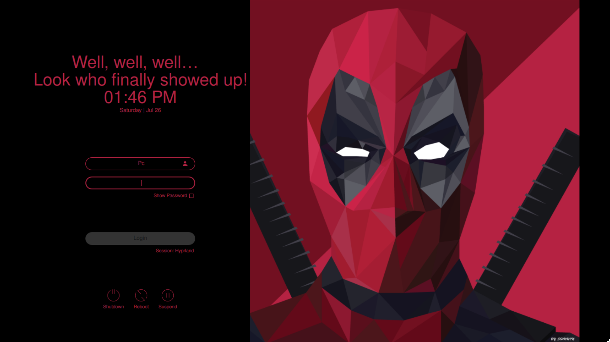

<h2 align="center">🗼 Tokyo Night SDDM 🗼</h2>

<p align=center>
A Tokyo Night theme for the <a href="https://github.com/sddm/sddm">SDDM Login Manager</a>
</p>

<h2 align=center>Preview</h2>
<center>

</center>

## Install
### From sources
> _Assumes that you've installed and configured SDDM correctly_ (if not [read more](https://wiki.archlinux.org/title/SDDM))

>  Please make sure you have the following dependencies installed:
>  `qt5-quickcontrols2`, `qt5-graphicaleffects`, `qt5-svg` 

1. Open terminal, and clone the repository with:

   ```sh
   git clone https://github.com/Kapy2003/Tokyo-Night-SDDM-Reskinned.git ~/tokyo-night-sddm-reskinned
   ```

2. Them move it as follows:

   ```sh
   sudo mv ~/tokyo-night-sddm-reskinned /usr/share/sddm/themes/
   ```

## Configure

Edit the `/etc/sddm.conf` (with any text editor with **raised** privileges), so that it looks like this:

```sh
sudo nano /etc/sddm.conf  # use any text editor with raised privileges
---
[Theme]
Current=tokyo-night-sddm-reskinned
   ```

### Language and time format

- You can also change the time format.
- To change the default wallpaper put desired image in the `tokyo-night-sddm-reskinned/Backgrounds/` folder and add the name of the image followed by its extension (`.jpg` or `.png`) in `theme.conf` file.
- You can also customize it further if you wish in the `theme.conf`
(blur, form position, etc).
## Credits

- Based on the theme [`Tokyo Night SDDM`](https://github.com/siddrs/tokyo-night-sddm)
- Based on the theme [`Sugar Dark for SDDM`](https://github.com/MarianArlt/sddm-sugar-dark) by [**MarianArlt**](https://github.com/MarianArlt).
- AUR Package by [**julian-poidevin**](https://github.com/julian-poidevin)

## License

[GNU Lesser General Public License v3.0](LICENSE)
